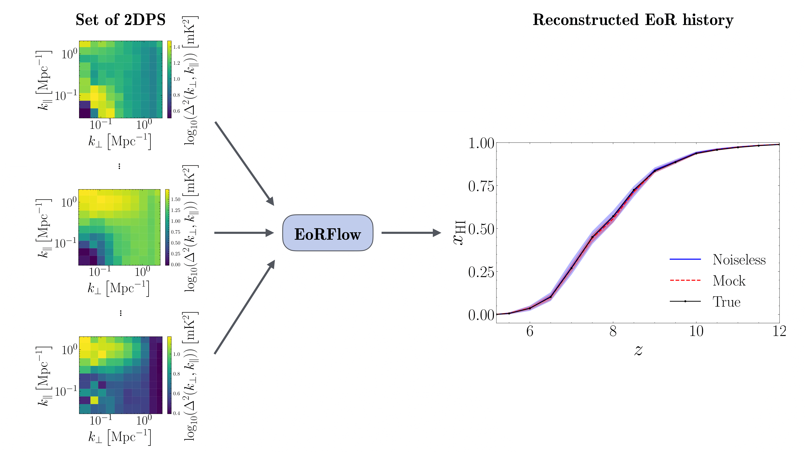

# EoRFlow

**Direct reconstruction of the Reionization history from 21cm (2D) Power Spectra**



## Overview

EoRFlow is a machine learning pipeline designed to reconstruct the global reionization history from simulated 21cm 2D power spectra. 

- Simulation-based inference (SBI) for likelihood-free problems
- Conditional invertible neural networks (cINNs) for posterior estimation
- easily adjustable to other physical or learned summaries of the 21cm signal 
- optionally with Convolutional neural networks (CNNs) for feature extraction

Read the paper here: [arXiv:2506.19925](https://arxiv.org/abs/2506.19925)

## Usage 

Training a new model:
```
python ./src/training/train_eorflow.py
```
Evaluating a model:
```
python ./src/evaluation/eval_eorflow.py
```
The code to produce the plots from the paper can be found in `./src/evaluation/plots`. The trained models as well as the plots are saved in `./output`.

## Updates
- currently supports spherically (1D) and cylindrically (2D) averaged power spectra
- new modes for image based inference to be added soon
